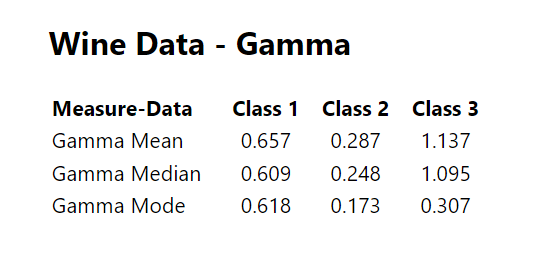

# To get started with the project, clone the repository from github.
https://github.com/ashishmaurya089/ManufacAnalyticsAssignment.git

# Run this command to install the required dependencies using Yarn
yarn install

# Run the Application Or Start the ReactJS application use this command
yarn start
Open [http://localhost:3000](http://localhost:3000) to view it in your browser.

# Data Set
Data set is presents inside WineData.json. 

# Project Structure
This React component calculates and displays on table mean, median, and mode for both "Flavanoids" and "Gamma."

# In Flavanoids property
calculate the class-wise mean, median, mode of “Flavanoids” for the entire dataset.!

# Flavanoids Table Screenshot of output.   
[Flavanoids Solution Table Screenshot](src/Images/FlavanoidstableSnap.png)

# In Gamma property
calculated as Gamma = (Ash * Hue) / Magnesium.Thereafter, calculate the class-wise mean, median, mode of “Gamma” for the entire dataset.

# Gamma Table Screenshot of output.

# There is an error of provided data**************************
In line number 2200. This data is in string form => "Flavanoids": "0.98" I have change this to solve my solution.